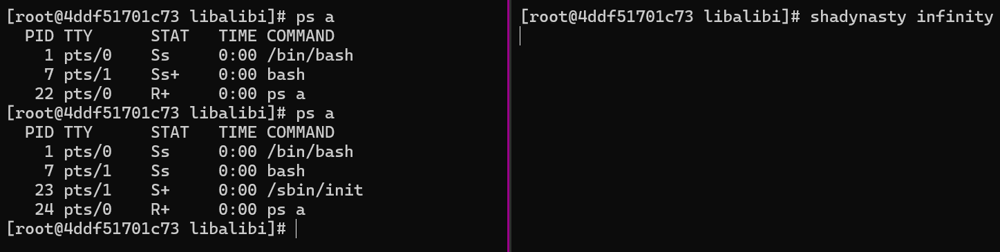

# libalibi
This project is a Linux dynamic shared library that modifies the presentation of running processes by intercepting calls to the `read` function from the standard C library (`libc`). It uses LD_PRELOAD to inject itself into a running process and alter the behavior of the `read` function.

## Demo

## Usage

To use the library:

1. Edit the `PROCS_TO_REPLACE` hashmap to contain the values you wish to modify.  

2. Compile it for your platform as demonstrated in the Dockerfile

3. Preload the shared library in the environment. This can be done for a single environment with the `LD_PRELOAD` environment variable, or across an entire system by writing the shared object file's path to `/etc/ld.so.preload`. 

## Future Improvements

1. Add the ability to remove a process altogether by modifying readdir() response
2. Hide modifications from filesystem checks (/proc/x/stat file and /proc/x/exe link)
3. Support regex for process cmdline matching